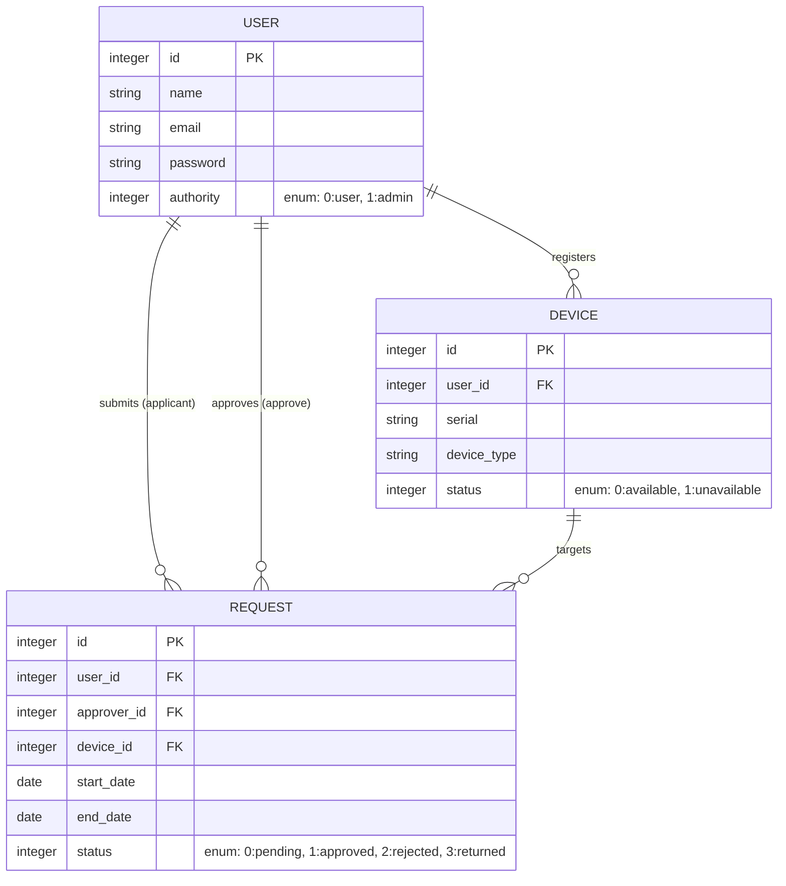

# AssetFlow 企業向け備品貸し出し管理アプリ

## アプリの概要
社内備品の管理・貸出フローをデジタル化し、効率的な資産管理を支援するシステムです。  
PCや外付けHDDなどの備品在庫を可視化し、従業員による利用申請から管理者による承認までをワンストップで完結させます。
## 開発背景
現職の備品貸出フローにおいて、在庫確認や申請をチャットで行うことによる情報の不透明さを解消したいと考え、本アプリを開発しました。  
機器のステータスを可視化し、申請・承認フローを一つのシステムに統合することで、誰でも「今何が借りられるか」を即座に判断し、スムーズに手続きを進められるシステムを目標に開発しました。
## 主要機能
・備品一覧: 登録されている備品のステータス（利用可能・貸出中など）を確認。  
・利用申請機能: 利用期間を入力し、承認者を選択して申請。  
・承認・否認ワークフロー: 管理者によるコメント付きの承認/否認アクション。  
・ユーザー管理: 一般ユーザーと管理者権限の切り分け。  
・マイページ：自分が作成した申請一覧の閲覧、管理者であれば、登録した機器や届いている未承認の申請一覧の閲覧も可能。
## 使用技術
### フロントエンド
・HTML / CSS / JavaScript  
・BootStrap 5: レイアウト

### バックエンド
・Ruby 3.3.3  
・Ruby on Rails 7.2.3   
・Devise: ユーザー認証機能

### データベース
・PostgreSQL（本番環境）  
・SQLite3（開発環境）

### テスト・品質管理
・RSpec: Model/System Spec  
・GitHub Actions

### インフラ・開発環境
・Vercel: デプロイ  
・Git/GitHub: ソースコード・バージョン管理

## DB設計

## 今後の展望

### 短期的な目標
・備品検索機能の追加  
・マイページの一覧にページネーション導入  
・データの整合性を考慮した、備品やアカウントの削除機能  

### 中長期的な目標
・通知機能の拡充  
ユーザー体験向上のため、アプリ内通知に加え、LINE Messaging APIやSlack Webhookを利用した外部ツールへの通知連携を実装し、承認漏れや確認遅延を防ぐ仕組みを構築予定です。

・動的な承認ワークフローへの対応  
現在の1対1の承認フローから、組織構造に合わせた多段承認（例：申請者 → 上長 → 部長）や、承認ルートの動的な変更に対応可能にします。

・承認プロセスの可視化  
ステータス管理をより詳細化し、現在誰が確認中なのか、どこでプロセスが止まっているのかを視覚的に把握できるようにします。