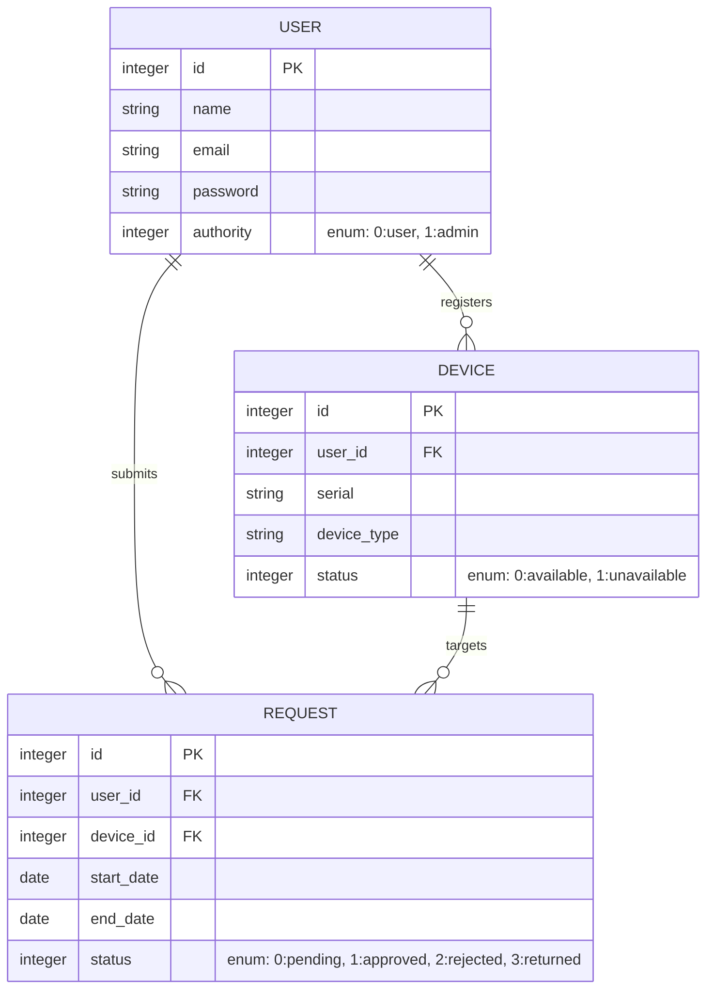

# README

# rental_app

### DB設計

```mermaid
erDiagram
    USER ||--o{ DEVICE : registers
    USER ||--o{ REQUEST : submits
    DEVICE ||--o{ REQUEST : targets

    USER {
        integer id PK
        string name
        string email
        string password
        integer authority "enum: 0:user, 1:admin"
    }

    DEVICE {
        integer id PK
        integer user_id FK
        string serial
        string device_type
        integer status "enum: 0:available, 1:unavailable"
    }

    REQUEST{
        integer id PK
        integer user_id FK
        integer device_id FK
        date start_date
        date end_date
        integer status "enum: 0:pending, 1:approved, 2:rejected, 3:returned"
    }
```